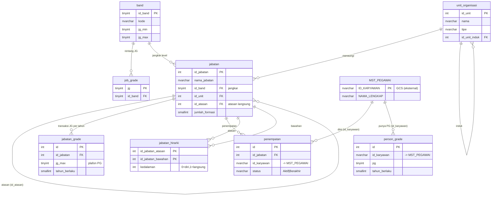

# Desain Database — Job Grade (JG) & Person Grade (PG) MyGCS

Konsolidasi diskusi tim (Pak A, Pak F, Pak J) atas *Analisis Pemetaan Job Grade PT GCS — Revisi 5 (Juli 2026)*.
DDL: [`jobgrade-schema.sql`](jobgrade-schema.sql) · Contoh data: [`Contoh-JobGrade-PG-transaksional.xlsx`](Contoh-JobGrade-PG-transaksional.xlsx).

## 1. Prinsip

| Lapisan | Tabel | Sifat |
|---|---|---|
| **Master / jangkar** | `band` (0=Direksi, I–VI) + `job_grade` (skala 7–21) | Stabil. Patokan apa pun perubahan struktur. |
| **Struktur** | `unit_organisasi`, `jabatan` | Band melekat di `jabatan`; atasan via `id_atasan` sampai Direksi. |
| **Transaksi (per tahun)** | `jabatan_grade` (JG), `person_grade` (PG) | JG & PG bisa berubah tiap tahun → dicatat per `tahun_berlaku`. "Terkini" = tahun terbaru. |
| **Penempatan** | `penempatan` | Siapa mengisi jabatan mana (incumbency). |
| **Turunan** | `jabatan_hirarki` | Daftar atasan–bawahan segala tingkat, **dibangun otomatis** dari `id_atasan`. |

Keputusan penting:
- **JG & PG = transaksi per tahun**, bukan master (Pak J). Skala JG↔Band tetap referensi.
- **Tidak ada versi/periode SO** untuk dibandingkan (Pak J: jangkarnya Band). Yang disimpan hanya struktur berlaku.
- **Atasan–bawahan**: yang diisi hanya `jabatan.id_atasan`; tabel `jabatan_hirarki` untuk query cepat dibangun otomatis.

## 2. ERD



## 3. Alur pengisian

1. **Band** dibuat sekali (master, termasuk Direksi).
2. **Jabatan** dibuat: `id_band` (jangkar) + `id_atasan` (garis lapor sampai Direksi) + `id_unit` → jalankan `usp_bangun_hirarki_jabatan`.
3. **JG jabatan**: isi `jabatan_grade` (`jg_max`, `tahun_berlaku`). Tahun depan JG berubah → tambah baris tahun baru.
4. **Pegawai + PG**: isi `person_grade` (`pg`, `tahun_berlaku`).
5. **Penempatan**: isi `penempatan` (siapa mengisi jabatan mana).

## 4. Atasan–bawahan (satu sumber + tabel hirarki otomatis)

- Yang **diisi** hanya `jabatan.id_atasan` (atasan langsung), sampai Direksi.
- **`jabatan_hirarki`** (`id_jabatan_atasan`, `id_jabatan_bawahan`, `kedalaman`) memuat atasan–bawahan **segala tingkat**, dibangun `usp_bangun_hirarki_jabatan` (dipanggil aplikasi tiap struktur berubah). Query jadi pendek:

```sql
-- semua bawahan (segala tingkat) jabatan @X
SELECT id_jabatan_bawahan FROM grading.jabatan_hirarki WHERE id_jabatan_atasan=@X AND kedalaman>0;
-- semua atasan @X
SELECT id_jabatan_atasan  FROM grading.jabatan_hirarki WHERE id_jabatan_bawahan=@X AND kedalaman>0;
```

Karena `jabatan_hirarki` **turunan** (bukan manual), ganti struktur cukup ubah `id_atasan` lalu bangun ulang — tidak ada dua sumber data yang bisa berselisih.

## 5. Kebijakan PG ≤ JG

PG **boleh** > JG jabatan (grandfathered, gaji tak turun) → statusnya **dibekukan**, bukan ditolak. Dihitung view `grading.vw_status_pg_jg` dari **PG terkini** vs **JG terkini** jabatan yang diduduki:

| PG vs jg_max | status_kebijakan |
|---|---|
| `PG > jg_max` | **PG di atas JG - dibekukan** |
| `PG = jg_max` | Selaras (mentok di JG jabatan) |
| `PG < jg_max` | Ada ruang naik |

## 6. View bantu (semua Bahasa Indonesia)

- `vw_jg_terkini` / `vw_pg_terkini` — JG & PG **terkini** (tahun terbaru).
- `vw_penempatan_aktif` — incumbent saat ini.
- `vw_status_pg_jg` — tabel kebijakan PG≤JG.
- `vw_rekap_band` — Formasi/Terisi/Kosong per Band.
- `vw_bagan_organisasi` — bagan organisasi (jabatan+atasan+band+JG+incumbent) untuk visualisasi.

## 7. Tautan ke DB existing

`id_karyawan` → `GCS.dbo.MST_PEGAWAI.ID_KARYAWAN` (kunci bisnis lintas-DB, tanpa FK fisik). Jembatan opsional: `jabatan.id_jabatan_sdm` ↔ `PEGAWAI_SDM.id_jabatan`, `unit_organisasi.id_struktur_sdm` ↔ `id_struktur`, `person_grade.golongan_lama` ↔ `GOL`.

## 8. Catatan
Tanpa versi SO, **struktur historis tidak tersimpan** (hanya struktur terkini) — sesuai Pak J. Histori grading tetap ada lewat `tahun_berlaku` pada `jabatan_grade` & `person_grade`. Bila suatu saat perlu bandingkan struktur antar-tahun, tinggal tambah tabel versi SO tanpa membongkar yang ada.
