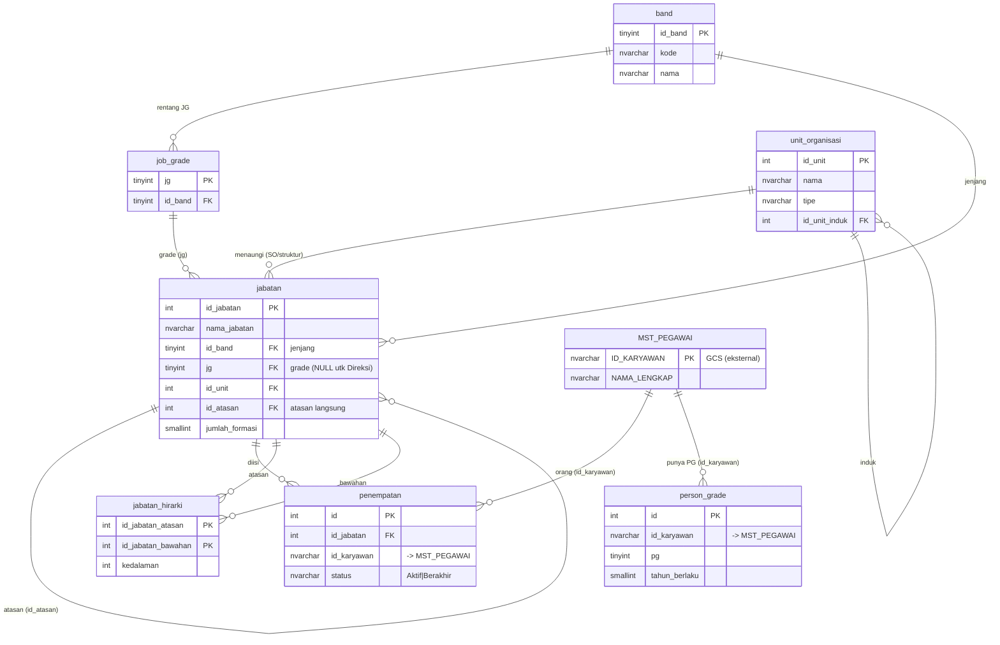

# Desain Database — Job Grade (JG) & Person Grade (PG) MyGCS

Konsolidasi diskusi tim (Pak A, Pak F, Pak J) atas *Analisis Pemetaan Job Grade PT GCS — Revisi 5 (Juli 2026)*.
DDL: [`jobgrade-schema.sql`](jobgrade-schema.sql) · Contoh data: [`Contoh-JobGrade-PG-final.xlsx`](Contoh-JobGrade-PG-final.xlsx).

## 1. Prinsip

| Lapisan | Tabel | Peran |
|---|---|---|
| **Jenjang (jangkar)** | `band` (0=Direksi, I–VI) | Pengelompokan level. **Bukan** tempat JG. |
| **Skala JG** | `job_grade` (jg 7–21 → id_band) | Master skala JG + peta ke band. Di-link dari `jabatan.jg`. |
| **Struktur** | `unit_organisasi`, `jabatan` | **JG melekat di `jabatan` (kolom `jg`)**; band = jenjang; atasan via `id_atasan`. |
| **Penempatan** | `penempatan` | Siapa mengisi jabatan mana (orang ↔ jabatan). |
| **PG (transaksi/tahun)** | `person_grade` | PG per pegawai; "terkini" = tahun terbaru. |
| **Turunan** | `jabatan_hirarki` | Atasan–bawahan segala tingkat, dibangun otomatis dari `id_atasan`. |

Keputusan kunci (hasil revisi atas masukan Pak J & Pak A):
- **JG = kolom `jg` di `jabatan`** (bukan di band, bukan tabel transaksi terpisah). Contoh Band III: Kabag Perbendaharaan `jg=16`, Kabag Pengadaan `jg=15`, Kabag Jasa Gudang `jg=16`.
- **`band` tanpa `jg_min`/`jg_max`** — band hanya jenjang; rentang JG ada di `job_grade`.
- **`job_grade` di-link** ke jabatan (`jabatan.jg` → `job_grade.jg`).
- **"SO/struktur"** = `unit_organisasi` (jabatan menempel lewat `id_unit`).

## 2. ERD



## 3. Contoh (Pak A) — JG melekat ke jabatan

| jabatan | id_band | jg |
|---|---|---|
| Kabag Perbendaharaan | 3 | 16 |
| Kabag Pengadaan | 3 | 15 |
| Kabag Jasa Gudang | 3 | 16 |

Satu Band (III) bisa berisi jabatan ber-JG berbeda (15/16) — karena **JG di jabatan**, band cuma jenjang.

## 4. Menjawab pertanyaan tim

- **"band fungsinya apa?"** → pengelompokan jenjang (Direksi, I–VI): penamaan tingkatan, rekap per band, dan jangkar stabil. Bukan tempat JG.
- **"band jg_min/max buat apa?"** → sudah **dihapus**; rentang JG ada di `job_grade`.
- **"job_grade fungsinya apa, tak ada link ke jabatan?"** → master skala JG 7–21 + peta ke band, dan **kini di-link** lewat `jabatan.jg` (FK).
- **"jabatan malah tak ada jg?"** → sudah **ditambahkan** kolom `jg` di `jabatan`.
- **"JABATAN melekat ke SO?"** → ya, lewat `jabatan.id_unit` → `unit_organisasi` (struktur berlaku).
- **"penentuan jabatan di penempatan?"** → **bukan**. Definisi jabatan + JG = tabel `jabatan`; `penempatan` = siapa yang mengisi (orang).

## 5. Atasan–bawahan

`jabatan.id_atasan` (satu-satunya yang diisi) → tabel `jabatan_hirarki` dibangun otomatis (`usp_bangun_hirarki_jabatan`). Query cepat:
```sql
SELECT id_jabatan_bawahan FROM grading.jabatan_hirarki WHERE id_jabatan_atasan=@X AND kedalaman>0;
```

## 6. Kebijakan PG ≤ JG

`grading.vw_status_pg_jg` membandingkan **PG terkini** vs **`jabatan.jg`** jabatan yang diduduki. PG boleh > JG (grandfathered) → **dibekukan**, bukan ditolak.

## 7. Catatan
Riwayat perubahan JG per tahun tidak disimpan (JG kini kolom di jabatan) — sesuai penyederhanaan. Bila kelak perlu, tambah tabel riwayat terpisah tanpa membongkar `jabatan`. `id_karyawan` → `GCS.dbo.MST_PEGAWAI.ID_KARYAWAN` (lintas-DB, tanpa FK fisik).
